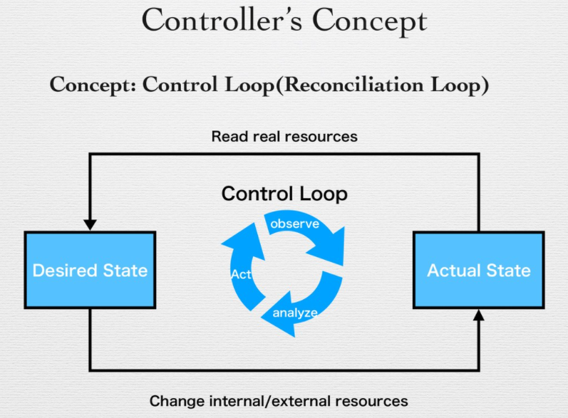

## GitOps in Kubernetes

In this section, we will cover the overall concepts of "GitOps" in the context and perspective of Kubernetes, including practical use-cases and demos of an existing tool called [Argo CD](https://argo-cd.readthedocs.io/en/stable/).

## What is GitOps?

The "GitOps", was pionieered in 2017 by engineers from [Weaveworks]. It is a way to manage Kubernetes clusters and application delivery respecting the design and principles of Kubernetes.

As we already learned, Kubernetes deployment is all based on the manifests in YAML or JSON format and you can take advantages of "Infra as Config (or Code)" using Git version control system. That also means that you can use Git as the SSoT (Single sorce of Truth).

### GitOps principles

As we do not have enough time to cover all deeply, we will introduce core concepts here. If you want to understand **GitOps** more deeply, [this document](https://www.weave.works/technologies/gitops/) is highly recommended.

#### 1. The entire system described declaratively
#### 2. The canonical desired system state versioned in Git
#### 3. Approved changes that can be automatically applied to the system.
#### 4. Software agents to ensure correctness and alert on divergence.

This basically means stored code in Git is **the declared/desired** state of your infra and all change management and its ecosystem is surrounded by that.

### Why GitOps with Kubernetes?

As you may have already learned in the Kubernetes basic, Kubernetes controller design is based on the 3-way diffs of the manifest, desired state and last-applied maniefst.



This occurs at every control loop period and each controllers pulls each desired state to perform the next action (Create, Update and Delete resources). Weaveworks calls GitOps as the pull-based deployment approach because it fits the Kubernetes design.

### Existing GitOps tools: Argo CD and Flux CD

There are two major GitOps engines for Kubernetes in real world: Argo CD and Flux CD.

#### Argo CD


Argo CD is a Kubernetes-native GitOps tool, running as a kubernetes controller which continuously monitors running applications and compares the current, live state against the desired target state (as specified in the Git repo).

Ref. https://argo-cd.readthedocs.io/en/stable/

#### Flux CD


Flux CD is a GitOps engine created by Weaveworks. So in the terms of "who made it", this looks like the most desired tool that meets "GitOps" principles.

There are major differences in Argo and Flux but so far there are more pulbic references with Argo but not Flux. You can use either one as long as they fulfil your requirement.

Ref. https://fluxcd.io/

### Security consideration of CIOps vs GitOps

Before Kubernetes era, most of automated deployments are done by CI tools such as Jenkins, Travis and Circle.

So, CI runs the app tests, validations, lint checking, applciation build and deployment. There is a potential lisk of having CI do everything. CI tools need to have all permissions to read the Git repo, evaluate it and deploy it to servers that implies you need both of Git and server credentials.


If you use GitOps, you no longer need to care about ingress traffic management in the perspective of deployment automation because everything is done just by egress traffic. All you need is just the container registry and git repository to deploy applications without complex firewall policies.

### Demo: Argo CD

#### Setup Argo CD

You can also do it in your environment, but for now we perform the demonstration.

Login to the bastion with port forwarding

```
ssh -L localhost:8080:localhost:8080 ec2-user@your-bastion-ip
```

Install helm if not installed.

```sh
$ curl https://raw.githubusercontent.com/helm/helm/main/scripts/get-helm-3 | bash
```

Install Argo CD in argocd namespace.

```sh
$ helm repo add argo https://argoproj.github.io/argo-helm
$ helm install argocd --create-namespace -n argocd argo/argo-cd
```

You can get the login URL and password information with the following commands.

```sh
$ kubectl -n argocd get secret argocd-initial-admin-secret -o jsonpath="{.data.password}" | base64 -d
$ kubectl port-forward service/argocd-server -n argocd 8080:443
```

Then access to http://localhost:8080 on your browser.

Login with ID `admin` and the password you fetched above. Now you see Argo CD Web UI!

#### Apply Application CRD

Argo CD provides a CRD named `Applications` to manage application deployment declaratively. You can use the Custome Resource to manage resources such as

- Helm chart
- Kustomized manifests
- Raw manifests stored in Git

Let's manage Argo CD itself that you deployed with Helm command, with this `Application` resource.

```yaml
apiVersion: argoproj.io/v1alpha1
kind: Application
metadata:
  name: argocd
  namespace: argocd
spec:
  project: default
  source:
    chart: argo-cd
    repoURL: https://argoproj.github.io/argo-helm
    targetRevision: 3.29.4
    helm:
      releaseName: argocd
      # # You can override "values" using this field
      # values: |
      #   redis-ha:
      #     enabled: true

      #   controller:
      #     enableStatefulSet: true

      #   server:
      #     replicas: 2
      #     env:
      #       - name: ARGOCD_API_SERVER_REPLICAS
      #         value: '2'
      #   repoServer:
      #     replicas: 2
  destination:
    server: https://kubernetes.default.svc
    namespace: argocd
  syncPolicy:
    automated:
      prune: true
    syncOptions:
    - CreateNamespace=true
```

Go on the web UI and you will see Argo CD is now managed by Argo CD itself.

#### Projects in Argo CD

If your cluster has to be multi tenant, Argo CD provides "projects" to separate environment within a namespace.

```yaml
apiVersion: argoproj.io/v1alpha1
kind: AppProject
metadata:
  name: monitoring
  namespace: argocd
  # Finalizer that ensures that project is not deleted until it is not referenced by any application
  finalizers:
    - resources-finalizer.argocd.argoproj.io
spec:
  description: monitoring project
  sourceRepos:
  - '*'
  destinations:
  - namespace: 'monitoring'
    server: https://kubernetes.default.svc
  clusterResourceWhitelist:
  - group: '*'
    kind: '*'
---
apiVersion: argoproj.io/v1alpha1
kind: AppProject
metadata:
  name: infra
  namespace: argocd
  # Finalizer that ensures that project is not deleted until it is not referenced by any application
  finalizers:
    - resources-finalizer.argocd.argoproj.io
spec:
  description: infra project
  sourceRepos:
  - '*'
  destinations:
  - namespace: 'infra'
    server: https://kubernetes.default.svc
  clusterResourceWhitelist:
  - group: '*'
    kind: '*'
---
apiVersion: argoproj.io/v1alpha1
kind: AppProject
metadata:
  name: dev
  namespace: argocd
  # Finalizer that ensures that project is not deleted until it is not referenced by any application
  finalizers:
    - resources-finalizer.argocd.argoproj.io
spec:
  description: dev project
  sourceRepos:
  - '*'
  destinations:
  - namespace: 'dev'
    server: https://kubernetes.default.svc
  clusterResourceWhitelist:
  - group: '*'
    kind: '*'
```

#### Demo 2: Declarative management of Prometheus and Grafana using Argo CD (optional: if we have time)

There is `monitoring` folder in this section. This instruction tells you how to manage a whole directory inside of a Git repo using Argo CD.

```yaml
apiVersion: argoproj.io/v1alpha1
kind: Application
metadata:
  name: monitoring-stack
  namespace: argocd
spec:
  project: monitoring
  source:
    repoURL: https://github.com/HIT-CNC/CNC-Handson-211.git
    targetRevision: HEAD
    path: gitops/monitoring
  destination:
    server: https://kubernetes.default.svc
    namespace: monitoring
  syncPolicy:
    automated:
      prune: true
    syncOptions:
    - CreateNamespace=true
```

Let's apply this manifest. Then you will see both grafana and prometheus will be deployed in the cluster. If you modify yaml files inside of the monitoring directory, Argo CD automatically tracks and follows it, then change it when the change is detected by GitOps loop.
